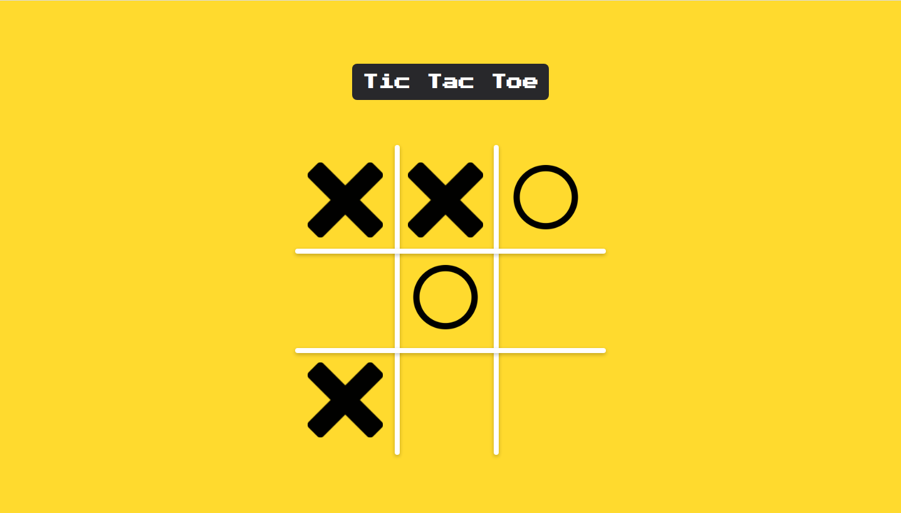

# Tic Tac Toe using minmax algorithm (AI)

## Table of contents

- [Overview](#overview)
  - [The challenge](#the-challenge)
  - [Screenshot](#screenshot)
  - [Links](#links)
- [My process](#my-process)
  - [Built with](#built-with)
  - [What I learned](#what-i-learned)
  - [Useful resources](#useful-resources)
- [Author](#author)

## Overview

### The challenge

Users should be able to:

- Play tic tac toe against computer or with other human player

### Screenshot



### Links

- Solution URL: [https://www.frontendmentor.io/solutions/order-summary-project-ggo5usLPS](https://www.frontendmentor.io/solutions/order-summary-project-ggo5usLPS)
- Live Site URL: [https://gabrielfmpinheiro.github.io/order-summary-component/](https://gabrielfmpinheiro.github.io/order-summary-component/)

## My process

### Built with

- Semantic HTML5 markup
- CSS custom properties
- Flexbox
- React
- Testing Library

### What I learned

```JS
/* minmax algorithm */
  minmax(board, isMaximizing, player) {
    let result = this.winner(board);

    if (result !== null) {
      return scores[result];
    }

    if (isMaximizing) {
      let bestScore = -Infinity;
      board.forEach((cell, i) => {
        if (cell === '') {
          board[i] = 1;
          let score = this.minmax(board, false, player);
          board[i] = '';
          bestScore = Math.max(score, bestScore);
        }
      });
      return bestScore;
    } else {
      let bestScore = Infinity;
      board.forEach((cell, i) => {
        if (cell === '') {
          board[i] = this.changePlayers();
          let score = this.minmax(board, true, this.changePlayers());
          board[i] = '';
          bestScore = Math.min(score, bestScore);
        }
      });
      return bestScore;
    }
  }
```

### Useful resources

- [React Testing Library](https://testing-library.com/docs/react-testing-library/intro/) - This helped me for test all my code.
- [Explanation of minmax algorithm](https://www.youtube.com/watch?v=trKjYdBASyQ) - This helped me for understand how the minmax algorithm works.
- [React Class Binder](https://github.com/Klathmon/react-class-binder) - This helped me for improve my code. I used the class method and the contructor, so this library makes the bind automatically.

## Author

- Linkedin- [Gabriel Pinheiro](https://www.linkedin.com/feed/)
- Frontend Mentor - [@GabrielFMPinheiro](https://www.frontendmentor.io/profile/GabrielFMPinheiro)
- Codewars - [@GabrielFMPinheiro](https://www.codewars.com/users/GabrielFMPinheiro)
